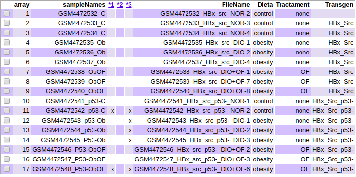
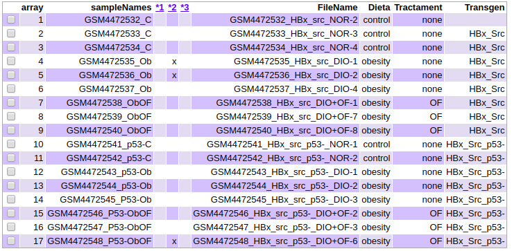
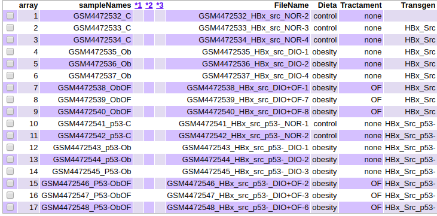

```{r setup, include=FALSE}
knitr::opts_chunk$set(echo = TRUE)
```


\pagebreak

# Abstract

 Aquest informe esta basat en l'estudi de les dades de microarray extretes del Gene Expression Omnibus (GSE148501), en el qual s'estudiava l'efecte d'un oligo-flucoidan en la prevenció del desenvolupament de l'hepatocarcinogènesis (estimulada per una mutació en p53 amb presència de HBx).
 Partim d'unes dades de microarrays de Affymatrix sobre els fetges de peix zebrat mutats (tots femelles i de mateixa edat) després del seguiment d'una dieta hipocalòrica on part del grup han estat tractats amb OF.
 
 El codi d'execució, així com al resta de fitxers descarregats i generats es poden trobar a : [https://github.com/Adria-FerDi/ADO_PEC1]


# Objectius

L'objectiu d'aquest exercici es el d'estudiar els efectes de OF en la prevenció de la hepatocarcinogènesis en Peix Zebra. Això sefectuarà mitjançant el re-analisis de microarrays d'expressió gènica de les dades de l'estudi. Comparant els nivells dels diferents condicions (Control-Dieta hipocalorica-Dieta hipocalòrica+Oligo-fucoidan) per als dos tipus de transgènics (p53+/-).

# Materials
## Software
 Aquest informe ha utilitzat [R]^[https://cran.r-project.org/index.html] Com a programari principal de treball, mitjançant l'interfaç [RStudio]^[https://www.rstudio.com/].
 Algunes llibreries emprades no formen part del llistat de R, i s'ha recolzat molt en el paquet [Bioconductor]^[https://www.bioconductor.org/] com a eina principal per a l'anàlisis de dades òmiques.
 
## Dades 
 Les dades emprades són d'acces públic des de la base de dades [GEO]^[https://www.ncbi.nlm.nih.gov/geo/browse/?view=series].l'experiment, amb codi GSE148501, tracta amb 17 individus, organitzats en 3 factors:
 
 * Mutació (p53 / p53-)
 
 * Dieta (Control / Obesa)
 
 * Tractament (cap / Oligo-fucoidan)
 
 En l'estudi base s'han emprat microarrays Affymetrix [ZebGene-1_1-st] Zebrafish Gene 1.1 ST Array [transcript (gene) version]

 
# Mètodes
## Pipeline

* 1 Preparació del entron de treball i descàrrega de dades.
* 2 Identificar grups i classificar individus.
* 3 Control de qualitat de les dades.
* 4 Normalització de les dades.
* 5 Control de qualitat de les dades normalitzades.
* 6 Filtratge no específic.
* 7 Control de qualitat de les dades filtrades.
* 8 Identificació de gens diferencialment expressats.
* 9 Anotació dels resultats
* 10 Comparació entre comparacions
* 11 Análisis de significancia biològica.

## Procediment
### Preparació de l'entorn de treball i descàrrega de dades:

 Primer de tot generem les carpetes necessàries per a l'efectuació del treball. I posteriorment descarreguem les dades des de GEO amb la funció getGEOSuppFiles(). Aquest procés ha necessitat de la llibreria GEOquery.
```{r Preparacio del entorn, echo=FALSE, warning=FALSE}
#Treballant des del RProject generat:
carp_global <- getwd()
dir.create("dades")
carp_dades <- file.path(carp_global, "dades/")
dir.create("resultats")
carp_resultats <- file.path(carp_global, "resultats/")
```

```{r Descarrega de dades, echo=FALSE, eval=FALSE, warning=FALSE}
library(GEOquery)
getGEOSuppFiles(GEO = "GSE148501", makeDirectory = F, baseDir = carp_dades)
```

### Identificar grups i classificar individus:

 A partir de les dades de GEO, generem un arxiu targets.csv amb la classificació dels arxius a cadascun dels grups, el qual té la següent forma (per mostrar-ho aqui s'han canviat els noms dels arxius per a una millor visualització):
```{r Classificacio individus, echo=FALSE, message=FALSE, warning=FALSE, results='hide'}
library(oligo)
library(Biobase)
cel_files <- list.celfiles(carp_dades, full.names = TRUE)
targets <- read.AnnotatedDataFrame(file.path(carp_dades, "targets.csv"), header = TRUE, row.names = 1, sep= ";")
raw_data <- read.celfiles(cel_files, phenoData = targets)
```

```{r Mostrar format targets, echo=FALSE, message=FALSE, warning=FALSE}
targets_show<-pData(raw_data)
targets_show$FileName<-"X"
targets_show
```
 Seguidament bolquem el contingut dels arxius al nostre entorn R, mitjançant la funció read.celfiles, combinant la llista dels noms d'arxius i el nostre dataframe de targets, generem l'objecte raw_data. Aquest procès ha necessitat de les llibreries oligo i Biobase.

### Control de qualitat de les dades:

 En aquest punt evaluarem la qualitat de les dades per a continuar amb l'estudi. 
 * Primer de tot, mitjançant la funció arrayQualityMetrics() generem un conjunt de anàlisis de les dades.
 * Seguidament farem l'anàlisis gràfic mitjançant un boxplot (Figure 2) i un cluster jeràrquic (Figure 3).
 
 Del resum de l'anàlisis (Figure 1) podem extreure que hi ha diverses mostres que tenen outliners i per tant no tenen una qualitat òptima.
 Del boxplot (Figure 2) podem extreure que hi ha relatives diferències entre les mostres, i que no semblen agrupar-se del tot segons els grups, tenint com exemple clar el cas de l'ultima mostra, que esta força diferenciada. Això es corrobora amb el cluster (Figura 3) on s'observa que si més no la majoria de grups estan relativament agrupats, hi ha un cas visiblement allunyat.
 Aquest procès ha necessitat de les llibreries arrayQualityMetrics, ggplot2 i ggrepel.
 
```{r Control qualitat raw, echo=FALSE, eval=FALSE, warning=FALSE}
library(arrayQualityMetrics)
arrayQualityMetrics(raw_data, outdir = file.path(carp_resultats, "QM_Raw")) 
```
```{r Imatge resum raw, echo=FALSE, warning=FALSE, out.width="60%", fig.align="center", fig.cap="Resumedels resultats obtinguts en l'arxiu index.html per al control de qualitat de les dades"}

```
```{r Boxplot dades raw, out.width="60%", fig.align="center", fig.cap="Boxplot d'intensitat dels arrays"}
library(ggplot2)
library(ggrepel)
boxplot(raw_data, cex.axis = 0.5, las=2, which="all", main="", col = c(rep("gold2", 3), rep("darkorange", 3), rep("red3", 3), rep("lightblue1", 2), rep("deepskyblue3", 3),rep("darkslateblue", 3)))
```
```{r Hclust dades raw, out.width="60%", fig.align="center", fig.cap="Cluster jeràrquic"}
plot(hclust(dist(t(exprs(raw_data)))))
```

### Normalització de les dades:

  Passem doncs, a la normalització de les dades, per veure si es corregeixen els errors detectats anteriorment. Amb aquets procés s'intenta que les mostres siguin mes comparables entre si, intentant evadir la variabilitat deguda a araons tècniques o d'anàlisis. En aquets cas hem fet servir el mètode de Robust Multichip Analysis (RMA) mitjançant la funció rma().
  
```{r Normalitzacio de les dades, echo=FALSE, message=FALSE, warnings=FALSE}
rma_data <- rma(raw_data)
```

### Control de qualitat de les dades normalitzades:
 
 Procedirem com en les dades en cru, i efectuarem els mateixos anàlisis de qualitat.
 En aquest cas, veiem com en el resum de l'anàlisis (Figure 4) encara queda algun grup amb outliners (que de fet no són els mateixos que tenim abans).
 En el cas del boxplot (Figure 5) si que s'aprecia una millora amb la normalització de les dades. Però el cluster (Figure 6) segueix tenint algunes incoherencies d'agrupament, tot i que no tant abruptes com en el cas anterior.
 
```{r Control qualitat dades normalitzades, out.width="60%", echo=FALSE, eval=FALSE, warning=FALSE}
arrayQualityMetrics(rma_data, outdir = file.path(carp_resultats, "QM_Rma")) 
```
```{r Imatge resum dades normalitzades, echo=FALSE, warning=FALSE, out.width="60%", fig.align="center", fig.cap="Resumedels resultats obtinguts en l'arxiu index.html per al control de qualitat de les dades normalitzades"}

```
```{r Boxplot dades normalitzades, echo=FALSE, warning=FALSE, out.width="60%", fig.align="center", fig.cap="Boxplot d'intensitat dels arrays de les dades normalitzades"}
boxplot(rma_data, cex.axis = 0.5, las=2, which="all", main="", col = c(rep("gold2", 3), rep("darkorange", 3), rep("red3", 3), rep("lightblue1", 2), rep("deepskyblue3", 3),rep("darkslateblue", 3)))
```
```{r Hclust dades normalitzades, echo=FALSE, warning=FALSE, out.width="60%", fig.align="center", fig.cap="Cluster jeràrquic de les dades normalitzades"}
plot(hclust(dist(t(exprs(rma_data)))))
```

### Filtratge no específic:

Executarem un filtratge no específic de les dades, per evitar la sobrecomparació de gens, buscant com objectiu comaprar nomes aquells gens que estan evidentment més diferenciat en les diferents mostres.

Primerament generem un gràfic on visualitzem la desviació standard dels gens (Figure 7) per poder decidir quins poden considerar-se diferencialment expressats. S'han afegit unes linies verticals en els percentils 90 i 95.
 Seguidament fem el filtrat de gens. Mitjançant la funció nsFilter() que permet filtrar gens marcant un umbral de variabilitat, tot junt amb el paquet d'anotacions pertinent que permet també, evitar aquells gens que no tenen un identificador associat.
 Aquest procès ha necessitat les llibreries genefilter, DBI i pd.zebgene.1.1.st

```{r Deteccio de gens variables, echo=FALSE, out.width="60%", fig.align="center", fig.cap="Distribució de la variabilitat dels gens"}
sds <- apply(exprs(rma_data), 1, sd)
plot(1:length(sds), sort(sds), xlab="Gens de menys a més variable", ylab="Desviació estàndard")
abline(v=length(sds)*c(0.9,0.95))
```
```{r Filtratge de gens, echo=FALSE, warning=FALSE }
library(genefilter)
library(DBI)
library(pd.zebgene.1.1.st)
annotation(rma_data) <- "pd.zebgene.1.1.st"
filtered <- nsFilter(rma_data, require.entrez = FALSE, remove.dupEntrez = FALSE, var.filter=TRUE, var.func=IQR, var.cutoff=0.7, filterByQuantile=TRUE)
filtered_data <- filtered$eset
```
```{r resultats filtratge, echo=FALSE, warning=FALSE}

print("Nombre de Gens de les dades normalitzades")
nrow(exprs(rma_data))
print("Nombre de gens una vegada filtrats")
nrow(exprs(filtered_data))
print("Nombre de gens eliminats")
print(filtered$filter.log)
```

### Control de qualitat de les dades filtrades:

 De manera anàloga als casos anteriors, procedim amb el control de la qualitat de les dades.
 En el resum de l'anàlisis (Figure 8) observem que finalment no hi ha cap mostra amb outliners.
 En el cas del boxplot (Figure 9) es manté la millora anterior, no hi ha grans diferencies d'entre els diferents grups de l'estudi.
 Però el cluster (Figure 10) segueix tenint algunes incoherencies d'agrupament, tot i que si ens fixem en on es donen (alguns tractaments estan massa aprop dels controls), sembla que podrien ser resultats alentadors per l'estudi.

```{r Control qualitat dades filtrades, echo=FALSE, eval=FALSE, warning=FALSE}
arrayQualityMetrics(filtered_data, outdir = file.path(carp_resultats, "QM_Filt")) 
```
```{r Imatge resum dades filtrades, echo=FALSE, warning=FALSE, out.width="60%", fig.align="center", fig.cap="Resumedels resultats obtinguts en l'arxiu index.html per al control de qualitat de les dades filtrades"}

```
```{r Boxplot dades filtrades, echo=FALSE, warning=FALSE, out.width="60%", fig.align="center", fig.cap="Boxplot d'intensitat dels arrays amb les dades filtrades"}
boxplot(filtered_data, cex.axis = 0.5, las=2, which="all", main="", col = c(rep("gold2", 3), rep("darkorange", 3), rep("red3", 3), rep("lightblue1", 2), rep("deepskyblue3", 3),rep("darkslateblue", 3)))
```
```{r Hclust dades filtrades, echo=FALSE, warning=FALSE, out.width="60%", fig.align="center", fig.cap="Cluster jeràrquic de les dades filtrades"}
plot(hclust(dist(t(exprs(filtered_data)))))
```


### Identificació de gens diferencialment expressats:

 La identificació de gens diferencialment expressats es basa en un conjunt de metodes i test per comparar grups. El paquet limma esta especialment dissenyat per a l'anàlisis de microarrays, amb les eines necessàries per a seleccionar els gens diferenciats.

#### Obtencio de les matrius: 
 Per executar els metodes linials necessitem crear una matriu de disseny on s'engloba a quin grup pertany cada mostra.
 
```{r Matriu de diseny, echo=FALSE, message=FALSE, warning=FALSE, results='hide'}
library(limma)
matriu_disseny<- model.matrix(~0+targets$Grup, pData(filtered_data))
colnames(matriu_disseny) <- c("Ctrl","Obes","Obes_OF","p53_Ctrl","p53_Obes","p53_Obes_OF")
#Els nomes nomes especifiquen p53 perque p53- suposa problemes en el llenguatge de R per la presència de "-"
```

Amb aquesta matriu es poden fer multiples comparacions, ja que tenim 6 grups, pero els que estudiarem seran: control vs obesitat, control vs obesitat amb OF, i obesitat vs obesitat amb OF, duplicant-ho per a cada tipus de mutació p53. Aquest proces ha necessitat de la llibreria limma.

```{r Matriu contrast, echo=FALSE, warning=FALSE}
matriu_contrast <- makeContrasts ( CvsOb = Ctrl - Obes,
                                 CvsOb_OF = Ctrl - Obes_OF,
                                 ObvsOb_OF = Obes - Obes_OF,
                                 p53_CvsOb = p53_Ctrl - p53_Obes,
                                 p53_CvsOb_OF = p53_Ctrl - p53_Obes_OF,
                                 p53_ObvsOb_OF = p53_Obes - p53_Obes_OF,
                                 levels=matriu_disseny)

```

#### Estimació del model:

Amb les matrius definides podem pasar a estiamr les comparacions i realitzar els tests necessaris per obtenir els gens diferencialment expressats.
Utilitzarem aprt del paquet limma, amb la funció lmFit(), basat ens els models de Bayes, que retorna el Fold-Change i els p-valors ajustats.
```{r modelització}
fit<-lmFit(filtered_data,matriu_disseny)
fit.main<-contrasts.fit(fit,matriu_contrast)
fit.main<-eBayes(fit.main)
```

#### Llistat de gens

Mitjançant la funció topTable() de limma ordenem de manera ascendent els gens en funció de la p-value. Entenent que els primers gens seran els més diferenciats a nivell d'expressió.

```{r ordenació de diferenciació de gens}
Tab_CvsOb <- topTable(fit.main, number = nrow(fit.main),
                               coef="CvsOb", adjust="fdr")

Tab_CvsOb_OF <- topTable(fit.main, number = nrow(fit.main),
                               coef="CvsOb_OF", adjust="fdr")

Tab_ObvsOb_OF <- topTable(fit.main, number = nrow(fit.main),
                               coef="ObvsOb_OF", adjust="fdr")

Tab_p53_CvsOb <- topTable(fit.main, number = nrow(fit.main),
                               coef="p53_CvsOb", adjust="fdr")

Tab_p53_CvsOb_OF <- topTable(fit.main, number = nrow(fit.main),
                               coef="p53_CvsOb_OF", adjust="fdr")

Tab_p53_ObvsOb_OF <- topTable(fit.main, number = nrow(fit.main),
                               coef="p53_ObvsOb_OF", adjust="fdr")
```

```{r}
head(Tab_CvsOb)

head(Tab_CvsOb_OF)

head(Tab_ObvsOb_OF)

head(Tab_p53_CvsOb)

head(Tab_p53_CvsOb_OF)

head(Tab_p53_ObvsOb_OF)
```

Observem que tots els p-values son inferiors a 0.05 i per tant són significatius, rebutjant les hipòtesis nules i per tant demostrant que hi ha diferencies d'expressió de gens en les nostres mostres.

### Anotació dels resultats:

A continuació afegim informació als gens seleccionats. Definirem una funció que combinarà la informació dels arrays generats amb la informació de les bases de dades per a poder interpretar millor els resultat, els quals es guardaran en arxius .csv diferenciats.

```{r Definicio de la funcio per anotar}
annotatedTable <- function(topTab, anotPackage)
{
  topTab <- cbind(PROBEID=rownames(topTab), topTab)
  myProbes <- rownames(topTab)
  thePackage <- eval(parse(text = anotPackage))
  geneAnots <- select(thePackage, myProbes, c("SYMBOL", "ENTREZID", "GENENAME"))
  annotatedTopTab<- merge(x=geneAnots, y=topTab, by.x="PROBEID", by.y="PROBEID")
return(annotatedTopTab)
}
```
El codi R que executariem està a l'apendix en forma de text.

 La funció no funciona, he fet proves amb altres db de Peix Zebra i el problema no es soluciona, he intentat buscar bibliografia per extreure la informació que necessito d'una altre manera, però no ho he aconseguit.
 La funció si funcionava per altres estudis (i altres bases de dades). I he arribat a la conclusió de que aquesta base de dades té una estructura diferent.

### Comparació entre comparacions:

En el punt actual de l'estudi es interessant comparar quins gens es troben en comú en les diferents comparacions. 
Utilitzant la funció decideTest generem un objecte de R que ens permetrà despres comptar les repeticions en diferents comparacions:

```{r echo=FALSE, results='hide'}
res<-decideTests(fit.main, method="separate", adjust.method="fdr", p.value=0.5, lfc=1)
```

 A continuació un petit resum del nombre de sobreexpressions o sotaexpressions de les comapracions:

```{r echo=FALSE}
sum.res.rows<-apply(abs(res),1,sum)
res.selected<-res[sum.res.rows!=0,] 
print(summary(res))
```

I finalment els diagrames de Venn, mitjançant la funcio vennDiagram, obtenim els diferents diagrames per a les mostres p53- (Figure 11), i per a les mostres p53+ (Figure 12).
Amb tot això observem que en el cas de les p53+ tenim menys semblances entre els tres casos.
```{r Diagrama de Venn, echo=FALSE, out.width="60%", fig.align="center", fig.cap="Gens en común entre les comparacions p53+"}
#Generación diagrama de Venn
vennDiagram (res.selected[,1:3], cex=0.9)
title("Gens en común entre les comparacions p53-")
```
```{r Diagrama de Venn2, echo=FALSE, out.width="60%", fig.align="center", fig.cap="Gens en común entre les comparacions p53+"}
#Generación diagrama de Venn
vennDiagram (res.selected[,4:6], cex=0.9)
title("Gens en común entre les comparacions p53+")
```

```{r echo=FALSE, results='hide'}
#Almacenamiento de Diagrama de Venn en la carpeta figures
tiff("resultats/VennPlotp53-.tiff", res = 150, width = 5.5, height = 5.5, units = 'in')
vennDiagram (res.selected[,1:3], cex=0.9)
title("Gens en común entre les comparacions p53-")
dev.off()
tiff("resultats/VennPlotp53+.tiff", res = 150, width = 5.5, height = 5.5, units = 'in')
vennDiagram (res.selected[,4:6], cex=0.9)
title("Gens en común entre les comparacions p53+")
dev.off()
```

### Análisis de significancia biològica:

 Amb el llistat de gens que hauriem de tenir en aquest punt, hauriem d'analitzar-los per veure a que son degudes aquestes diferencies. Un bioleg o un gran entes en al materia faria un estudi ben exhaustiu, pero mitjançant paquets com Gene Enrichment Analysis podriem executar un conjunt de funcions que ens permetrien fer una anàlisis previ i prou complet.
 
 Sense els noms dels gens aquest apartat és molt d'executar i no s'obtindrien els resultats desitjats.

# Resultats:

 Fins aqui tenim el re-anàlisis de les dades de l'estudi, no puc comparar els resultats obtinguts amb els de l'estudi original ja que aquest encara no està publicat. Del meu estudi s'extreu que si hi ha diferencies entre els grups, pero caldria veure la resta d'interessos de l'estudi per saber si es confirmen o es desmenteixen les seves hipòtesis, i amb quins matissos.

# Discusió:

El meu treball m'ha suposat dificultats, probablement suscitades per la meva elecció de la font de base de dades, per diferents motius:

* Tot i que només hi havia 17 mostres, estaven agrupades en 6 grups diferents, que no vaig sapiguer caure en les dificultats afegides que em suposaria (i una vegada executat gran part del treball no em veia amb anims de canviar les dades).

* Són dades recents, d'un article que encara no està publicat, i per tant tot i que no he tingut problemes a l'hora d'obtenir les dades, i classificar-les, no he pogut contrastar els meus resultats, entre d'altres.

* Sembla que el organisme que han fet servir per l'estudi no m'ha ajudat amb el tema de les bases de dades (tot i que en part també es culpa meva).


I tot això ha ajudat a que la part final del meu treball hagi quedat una mica incomplet.
\pagebreak

# Apèndix:
Aquest es el codi de R que em dona l'error en la secció del anotament:

library(zebrafish.db)
anotatedTab_CvsOb<-annotatedTable(Tab_CvsOb,anotationsPackage="zebrafish.db")
write.csv(anotatedTab_CvsOb, file="/resultats/anotatedTab_CvsOb")

anotatedTab_CvsOb_OF<-annotatedTable(Tab_CvsOb_OF,anotationsPackage="zebrafish.db")
write.csv(anotatedTab_CvsOb_OF, file="/resultats/anotatedTab_CvsOb_OF")

anotatedTab_ObvsOb_OF<-annotatedTable(Tab_ObvsOb_OF,anotationsPackage="zebrafish.db")
write.csv(anotatedTab_ObvsOb_OF, file="/resultats/anotatedTab_ObvsOb_OF")

anotatedTab_p53_CvsOb<-annotatedTable(Tab_p53_CvsOb,anotationsPackage="zebrafish.db")
write.csv(anotatedTab_p53_CvsOb, file="/resultats/anotatedTab_p53_CvsOb")

anotatedTab_p53_CvsOb_OF<-annotatedTable(Tab_p53_CvsOb_OF,anotationsPackage="zebrafish.db")
write.csv(anotatedTab_p53_CvsOb_OF, file="/resultats/anotatedTab_p53_CvsOb_OF")

anotatedTab_p53_ObvsOb_OF<-annotatedTable(Tab_p53_ObvsOb_OF,anotationsPackage="zebrafish.db")
write.csv(anotatedTab_p53_ObvsOb_OF, file="/resultats/anotatedTab_p53_ObvsOb_OF")